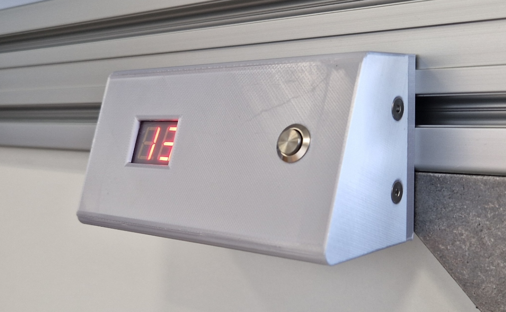

# AEGIS Beamer Protection Device

### For use in a Multi touch Table

- Running on Raspberry Pi Pico using Micropython 1.19.1  
- Uses the IR_RX/TX Library for Micropython

Pins:
```
0 - 15: Display  
16:     IR OUT  
21:     Button IN  
22:     Piezo OUT  

Electrical Diagram in Hardware/PCB folder
```



